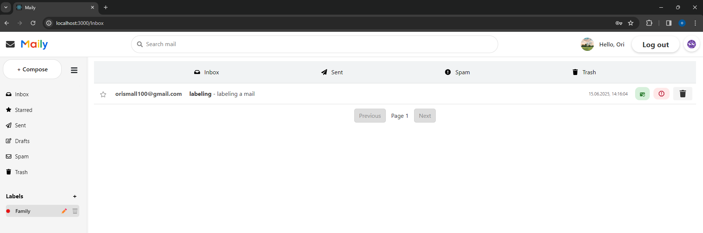

# Maily App

## Overview

This project implements **Maily** - a **Gmail-inspired application**, developed as part of an *Advanced Systems Programming* course.

The system includes:  

- **React WebApp**  
  A Gmail-like frontend built with React. It handles all email-related functionalities through a clean interface that includes three main screens: Login, Signup, and Inbox.

- **Node.js Web Server (MVC Architecture)**  
  Acts as the RESTful backend for the Gmail-like application. It handles user-related Functionalities such as registration, login, sending and receiving emails, managing labels, and more.  
  It also communicates with the C++ server when validating ,adding or deleting URLs.

- **C++ Multi-threaded TCP Server**  
  Handles blacklist operations (add, check, delete) using a **Bloom Filter** for efficient URL lookups.  
  The server supports multiple clients at the same time, using threads and ensures thread-safe access to shared resources.  
  Blacklisted URLs are persistently stored in `data/Blacklist.txt`.

This part of the project demonstrates:

- A **full-stack web application** with a Gmail-like user experience
- **TCP client-server** communication
- **RESTful API** design using **Node.js** (in **MVC** architecture)
- **Multi-threaded** programming and synchronization in C++
- Test-Driven Development (**TDD**) and SOLID design principles
- **Docker-based** development and deployment
- A modular, **loosely-coupled** architecture for easy future expansion

### Key Features

- **Gmail-like React frontend** with a responsive and intuitive UI

- **Three main UI views**: Login, Signup, and Inbox
- **RESTful API** for all email operations (send, receive, delete, draft and more...)
- **User authentication** and secure session management
- **Blacklist management** via the C++ server (add / check / delete URLs)
- **Multi-threaded C++ server** handling concurrent client requests safely
- **Efficient URL filtering** using a Bloom Filter
- **Persistent storage** of blacklisted URLs in `data/Blacklist.txt`
- **Dockerized environment** – easy setup with no manual dependency installation

---

## How to Build & Run

### Requirements
- Docker installed on your machine

### Build full application with Docker-compose:
The app (React, Node.js web server and C++ TCP server) can be built using a single command:  
```docker-compose up --build```  

By default, Docker Compose uses environment variables from the .env file located in the same directory.  
This file defines the following settings:  

**SERVER_PORT** = 12345  
**BITS_ARRAY_SIZE** = 16  
**HASH_FUNCS** = "1 2"  
**WEB_PORT** = 5001  
**WEB_CLIENT_PORT** = 3000  

You can override any of these variables at runtime using the command line:
```
WEB_CLIENT_PORT=<Web_Client_Port> \
WEB_PORT=<Web_Port> \
SERVER_PORT=<Server_Port> \
BITS_ARRAY_SIZE=<Bits_Array_Size> \
HASH_FUNCS="<Hash_Functions>" \
docker-compose up --build
```
Just make sure you enter valid arguments.       
- Note: If you change the WEB_PORT  , you must also update the value in the `.env` file located in the `web-client` folder.

To stop the app and exit, press `Ctrl + C`.

### Run the app
 Once the App is running, open your browser and navigate to:  
 ` http://localhost:<WEB_CLIENT_PORT>`  

 By default, go to : `http://localhost:3000`

To simulate multiple users, open the application in incognito browsing windows.  

---

## App usage screenshots and explanations
Below are screenshots and explanations demonstrating key features and usage flows of the Gmail-like web application.  

### Build app  
 

### Open app on browser


### Login, Signup, and Inbox screens
The **Signup** screen allows users to register with a name, email, password, birthdate, and profile picture. All fields are required and must be valid.  
The **Login** screen requires valid credentials to access the app.  
The **Inbox** screen includes navigation tabs: Inbox, Starred, Sent, Drafts, Spam, and Trash. Users can read, send, search, reply, forward, delete, and label emails through these views. 


### Upper Menu :  User Information button , Logout button, Theme button , Searchbar
The Upper Menu provides quick access to essential features.  
The **User Information button** shows details about the logged-in user. 
The **Logout button** allows the user to securely sign out of the application.  
The **Theme button** lets users toggle between light and dark modes for better visual comfort.  
The **Searchbar** enables users to quickly search through their emails by keywords, making it easier to find specific messages.


### Side Menu
The Side Menu provides quick access to all main **folders**: Inbox, Starred, Sent, Drafts, Spam, Trash, and Labels.  
It also includes a **Compose** button for writing new emails.  
The menu can be **collapsed** to a compact view showing only icons, saving screen space while keeping navigation accessible.  
Clicking an icon or expanding the menu allows full folder access.


### Send mails
To send a mail, click the **Compose** button, enter a valid email address of an existing user (or users) in the "To" field, fill in the "subject" and "content" fields as you wish, and click Send.  


### Labeling
The app allows users to create custom labels with a name and color to organize their emails.  
Labels can be assigned to any message from the MailView.  
Users can also edit existing labels (change name or color) and delete them when no longer needed, helping maintain a clean and organized mailbox.



### MailItem buttons 
Each mail item row includes up to four action buttons:  
  • **Mark as Read/Unread** – toggles the read status of the email.  
  • **Star/Unstar** – adds or removes a star to mark the email as important.  
  • **Mark as Spam** – moves the email to the Spam folder.  
  • **Move to Trash** – deletes the email by moving it to the Trash folder.  


### MailView buttons 
Each MailView includes several action buttons:  
  • **Move to Trash** – deletes the email by moving it to the Trash folder.  
  • **Mark as Spam** – moves the email to the Spam folder.  
  • **Label** – allows adding or removing custom labels to organize the email.  
  • **Reply** – opens a reply window with the original message quoted.  
  • **Forward** – opens a forward window with the original message included.  


### Inbox
 The Inbox folder displays all received emails that are not marked as
 spam or deleted.
 

### Sent
The Sent folder contains all emails the user has sent.
 

### Starred
The Starred folder displays all emails that the user marked as important by clicking the star icon.  
Users can toggle this status (star/unstar) either from the mail list or from the full MailView screen.  
This helps prioritize or quickly access important messages across all folders.


### Drafts
Whenever you click the X button to close the Compose window without sending, your current email is automatically saved as a draft.  
These drafts can be found in the Drafts folder, where you can open, edit, and send them later.  
This ensures you never lose unsent work and can continue composing at any time.


### Spam
Emails can be marked as Spam using the “Mark as Spam” button.  
When an email is sent to the Spam folder, **all URLs** found in its content are automatically added to the **blacklist**.  
 If no URLs are found, **the sender’s email address** is blacklisted instead.  
any incoming email containing a URL that already exists in the blacklist is automatically moved to the Spam folder, ensuring protection against known malicious links.
You can also mark emails as not Spam. When doing so, the related URLs or sender are **removed** from the blacklist to allow future messages through.


### Trash
Emails can be moved to the Trash using the “Move to Trash” button.  
Once in the Trash folder, messages are no longer visible in their original folders.  
Users can permanently delete these emails or restore them back to their original folder (Inbox or Sent).  
This provides a way to manage deletions safely, allowing recovery of accidentally deleted messages.


---

## Project Structure

- Project
    - src
        - Main
            - *.cpp
            - *.h
        - Web
            - controllers
                - *.js

            - models
                - *.js

            - routes
                - *.js

            - utils
                - *.js
            - app.js
            - package-lock.json
            - package.json 
        - Tests
            - test.cpp
    - Screenshots
        - *.png
    - data
        - Blacklist.txt
    - web-client
      - public
        - index.html
        - Maily.png
      - src
        - components
          - *.js
          - *.css
        - styles
          - *.css
        - app.js
        - index.js
      - .env
      - package-lock.json
      - package.json 
    - .env
    - .gitignore
    - CMakeLists.txt
    - docker-compose.yml
    - DockerfileClient
    - DockerfileReact
    - DockerfileServer
    - DockerfileTests
    - DockerfileWeb
    - README.md

---

## Authors
- Ori Small
- Ofek Sarusi
- Itay Turiel

---