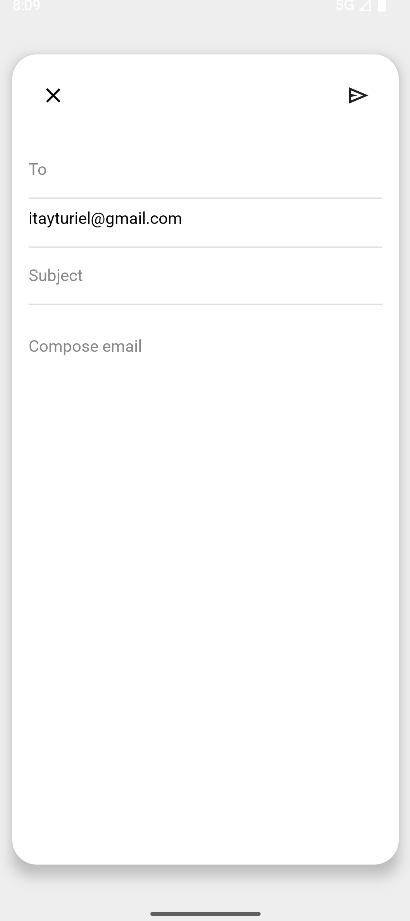

## Run the web app
 To use the Gmail-like Android application, run it on an emulator or physical device using Android Studio.  
Ensure that **Docker-compose** is running, and that the API base URL (configured in the `string.xml` file) points to `http://10.0.2.2:<WEB_PORT>/api/` when using an emulator.   
By default this is set to : `http://10.0.2.2:5001/api/`

---

## App usage screenshots and explanations
Below are screenshots and explanations demonstrating key features and usage flows of the Gmail-like android application.   

### Open the App on Emulator
when the emulator is running, press the **run** button in the upper bar of android studio to launch the app

### Login, Signup, and Inbox screens
The **Signup** screen allows users to register with a name, email, password, birthdate, and profile picture.   
All fields are required and must be valid.  
users can select a profile picture from their device's gallery.    
The **Login** screen requires valid credentials to access the app.    
The **Inbox** screen provides access to folders such as Inbox, Starred, Sent, Drafts, Spam, and Trash.  
Users can read, send, search, reply, forward, delete, and label emails through these views. 

### Page Options:  User Info , Searchbar , Compose button
The inbox screen offers quick access to essential features:    
-	The **User Info button** shows details about the logged-in user when clicking the profile picture.
-	The **Searchbar** allows users to quickly search through their emails by keywords.
-	The **Compose button** lets users create and send new emails.  

### Side Menu
The Side Menu provides quick access to all main **folders**: Inbox, Starred, Sent, Drafts, Spam, Trash, and Labels.  
The menu can be **collapsed** to show only the menu icon, saving screen space.    
The **Logout button** securely signs the user out of the app.  
Clicking a folder icon or expanding the menu provides full access to each folder.

### Send mails
To send an email, click the **Compose** button, enter a valid email address of an existing user (or multiple users) in the "To" field, fill in the "subject" and "content" fields as you wish, and click Send.  

### Labeling
The app allows users to create custom labels to organize their emails.    
Labels can be assigned to any message from the MailView screen.  
Users can also edit labels names and delete them when no longer needed.

### Mail buttons 
Each Mail item includes several action buttons: 
-	**Star/Unstar** - Mark the email as important or remove the star
-	**Mark as Read/Unread** - Toggle the read status of the email
-	**Move to Trash** - Move the email to the Trash folder
-	**Mark as Spam** - Move the email to the Spam folder
-	**Label** - Add or remove labels for organizing the email
-	**Reply** - Open a reply window with the original message quoted
-	**Forward** - Open a forward window with the original message included  

### Folders Overview
-	**Inbox** - Displays all received emails that are not marked as Spam or moved to Trash
-	**Sent** - Contains all emails the user has sent
-	**Starred** - Displays emails marked as important with a star
-	**Drafts** - Unsaved emails are automatically stored here when the Compose window is closed without sending. Drafts can be edited and sent later.

- **Spam** -  
Emails can be marked as Spam using the “Mark as Spam” button.  
When an email is sent to the Spam folder, **all URLs** found in its content are automatically added to the **blacklist**.  
If no URLs are found, **the sender’s email address** is blacklisted instead.  
any incoming email containing a URL that already exists in the blacklist is automatically moved to the Spam folder, ensuring protection against known malicious links.  
You can also mark emails as not Spam. When doing so, the related URLs or sender are **removed** from the blacklist to allow future messages through.

- **Trash** -  
Emails can be moved to the Trash using the “Move to Trash” button.  
Once in the Trash folder, messages are no longer visible in their original folders.  
Users can permanently delete these emails or restore them back to their original folder (Inbox or Sent).  
This provides a way to manage deletions safely, allowing recovery of accidentally deleted messages.

## Refresh mails
The Refresh button updates the current mail list for the selected folder (Inbox, Starred, Trash, etc.).  
When clicked, the application fetches the latest data from the server and displays the most up-to-date state of your emails.

---
